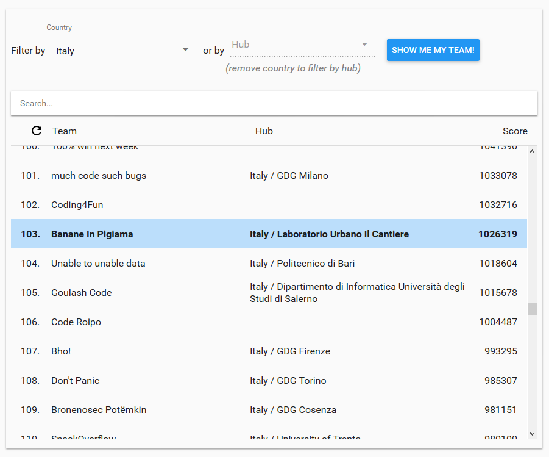
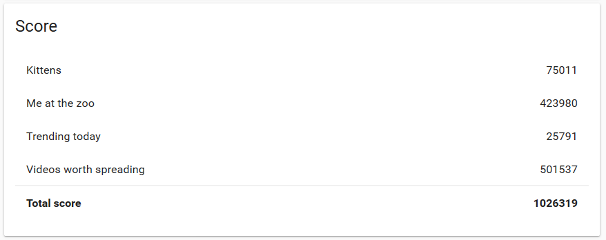
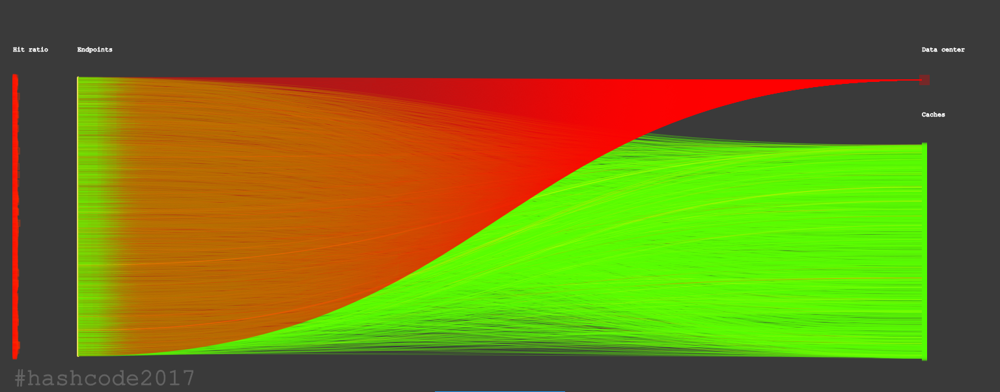
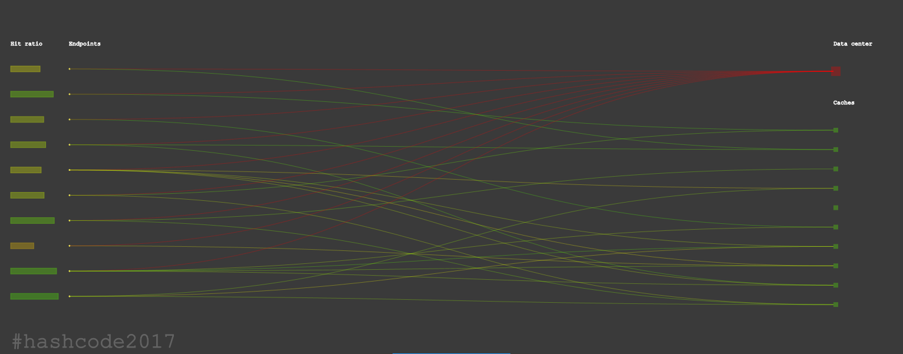
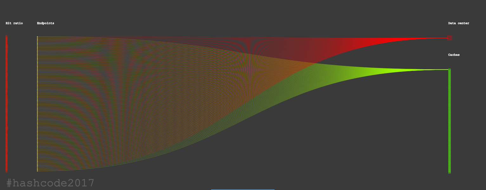
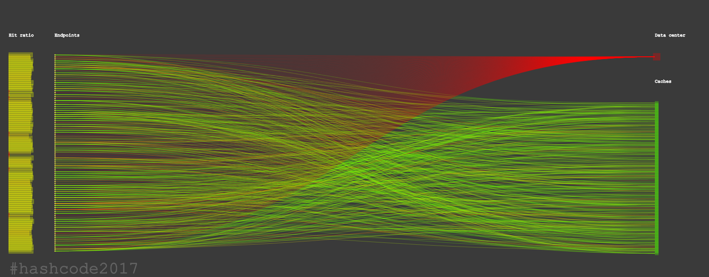

Hash Code 2017 - Qualification Round
========
The solution of "Banane In Pigiama" team for the problem proposed by Google in the qualification round of Hash Code 2017.
You can see the [document](problem/hashcode2017_streaming_videos.pdf) of the problem in this repository.

### Position in the italian ranking

### Best score details

#### Kittens diagram

#### Me at the zoo diagram

#### Trending today diagram

#### Video worth spreading diagram

